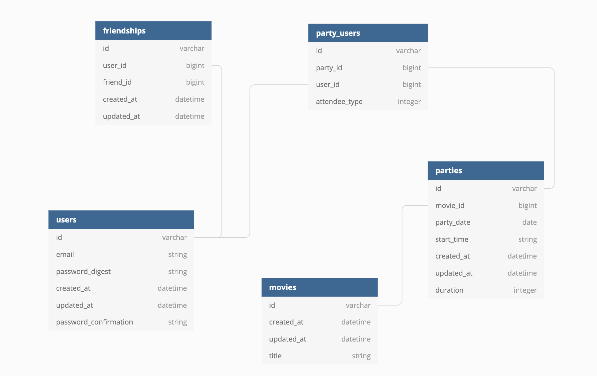

# Viewing Party

   


Viewing party is an application in which users can explore movie options and create a viewing party event for the user and friends.

#####[View live app](https://elmers-viewing-party.herokuapp.com/)

## Readme Content
- [Getting Started](#getting-started)
- [Running the Tests](#running-the-tests)
- [Database Schema](#database-schema)
- [Authors](#authors)

## Getting Started
```
$ git clone git@github.com:leahriffell/viewing_party.git 
  # or clone your own fork
$ cd viewing_party
```
### Prerequisites
- Ruby 2.5.3
- Rails 5.2.4.3

### Installing
#### Install gems and setup your database:
```
bundle install
rails db:create
rails db:migrate
rails db:seed
```

#### Run your own development server:
```
rails s
```
- You should be able to access the app via http://localhost:3000/

## Running the Tests
- Run with $ bundle exec rspec. All tests should be passing.

## Database Schema


## Authors
- Daniel Halverson | [github](https://github.com/dhalverson) | [linkedin](https://www.linkedin.com/in/daniel-halverson/)
- Leah Riffell | [github](https://github.com/leahriffell) | [linkedin](https://www.linkedin.com/in/leah-riffell/)
